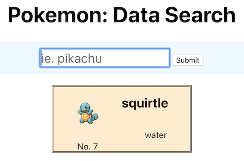
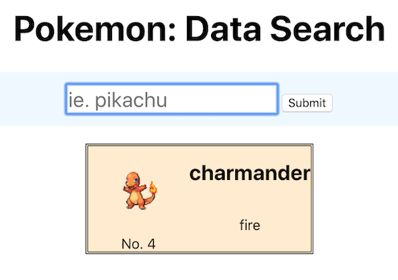

# Pokemon: Data Search

## Summary
The user is able to type the name of the first 151 original pokemon into the form input. Upon submit, the query fetches the pokemon data and displays minor information and an image about that particular pokemon below. 

## Build Motivation
A simple application primarily focusing on working with forms. The input form is able to reset the state to its initial value(state: '') after each submittion, allowing user to do multiple search queries. 

##Screenshots

